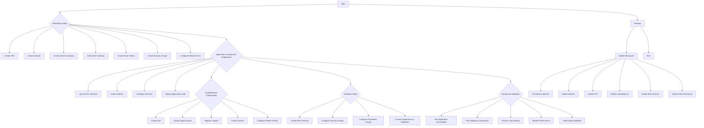

# AWS 3-Tier Web Application Deployment


This project demonstrates the deployment of a three-tier web application on AWS, including setting up networking, application components, load balancing, and database configuration.

## Project Overview

This project involves:
- 🏗️ Creating a Virtual Private Cloud (VPC) and subnets.
- 🌐 Configuring Internet and NAT gateways.
- 🚀 Deploying EC2 instances for web and application servers.
- ⚖️ Setting up an Application Load Balancer (ALB).
- 🗄️ Configuring an RDS MySQL database.
- 🛠️ Installing and configuring Apache, PHP, and phpMyAdmin.

here's a flowchart outlining the main steps involved in deploying the AWS 3-Tier Web Application:



This flowchart provides an overview of the steps involved in setting up the network, deploying application components, configuring the load balancer, setting up the database, testing and validating the deployment, and finally cleaning up the resources.

## Architecture Diagram


## Prerequisites

- 🧑‍💻 AWS account
- 📚 Basic knowledge of AWS services
- 💻 SSH client for connecting to EC2 instances

## Steps

### 1. Networking Setup

1. **Create a VPC**
   - **Name**: `myvpc`
   - **CIDR**: `172.20.0.0/16`
   

2. **Create Subnets**
   - Three **public subnets** (one in each availability zone):
     - `172.20.1.0/24`
     - `172.20.2.0/24`
     - `172.20.3.0/24`
   - Three **private application subnets** (one in each availability zone):
     - `172.20.4.0/24`
     - `172.20.5.0/24`
     - `172.20.6.0/24`
   - Three **private database subnets** (one in each availability zone):
     - `172.20.7.0/24`
     - `172.20.8.0/24`
     - `172.20.9.0/24`
   

3. **Configure Gateways**
   - Create and attach an **Internet Gateway** to the VPC.
   - Create a **NAT Gateway** in one of the public subnets with an Elastic IP.

4. **Create Route Tables**
   - Create and associate route tables for public, application, and database subnets.
   - Configure routes for the Internet Gateway and NAT Gateway.

### 2. Application Components Deployment

1. **Deploy EC2 Instances**
   - Launch an **EC2 instance** (Jump Server) in the public subnet.
   - Launch two **EC2 instances** (PHP App Servers) in the private application subnets.
   - Configure **security groups** and **key pairs** for SSH access.
   

2. **Install Software**
   - SSH into the Jump Server, then connect to the PHP App Servers.
   - Install **PHP** and **Apache** on the PHP App Servers.
   - Configure Apache and install **phpMyAdmin** for database management.

### 3. Load Balancer Configuration

1. **Create Application Load Balancer (ALB)**
   - Create an **ALB** with public subnets.
   - Create and configure a **target group** for the PHP App Servers.
   - Register the PHP App Servers as targets.
   - Adjust **security group rules** to allow ALB to communicate with the PHP App Servers.
   

### 4. Database Setup

1. **Create RDS Instance**
   - Create an **RDS MySQL** database instance in the private database subnets.
   - Configure **security groups** to allow the PHP App Servers to connect to the RDS instance.
   

2. **Configure phpMyAdmin**
   - Modify the phpMyAdmin configuration to connect to the RDS instance.
   - Enable **session stickiness** on the target group to handle stateful sessions.

## Verification

- Verify the proper functioning of the **Apache server** and **load balancing**.
- Test **phpMyAdmin** access and **database connection**.

## Resources Created

1. 🏗️ **VPC**
2. 📂 **Subnets** (Public, Application, Database)
3. 🌐 **Internet Gateway**
4. 🌍 **NAT Gateway**
5. 🛤️ **Route Tables**
6. 🖥️ **EC2 Instances** (Jump Server, PHP App Servers)
7. ⚖️ **Application Load Balancer**
8. 🗄️ **RDS MySQL Database**

## Conclusion

This project demonstrates a comprehensive setup of a 3-tier web application on AWS, providing a scalable and resilient architecture suitable for various web applications.

-----------------------------------------------------------------------------------------------------------------------------------------------------------------------------------------------------------------------------

Step by Step guid 

```markdown
# AWS 3-Tier Web Application Deployment

This project demonstrates the deployment of a highly available and scalable three-tier web application architecture on AWS, consisting of a web tier, application tier, and database tier.

## Architecture Overview


The architecture includes the following components:

1. Virtual Private Cloud (VPC): Isolated virtual network for the application.
2. Subnets: Public, private application, and private database subnets across multiple Availability Zones (AZs) for high availability.
3. Internet Gateway: Provides internet access to resources in the public subnets.
4. NAT Gateway: Allows resources in private subnets to access the internet.
5. Web Servers: Two EC2 instances running Apache and PHP in the private application subnets.
6. Application Load Balancer (ALB): Distributes traffic across the web servers in the public subnets.
7. RDS MySQL Database: A Multi-AZ RDS MySQL database instance in the private database subnets for high availability.

## Prerequisites

- AWS account
- AWS CLI installed and configured
- SSH client (e.g., PuTTY for Windows, Terminal for macOS/Linux)

## Step-by-Step Deployment

### 1. Networking Setup

1. Create a VPC:

   ```bash
   aws ec2 create-vpc --cidr-block 172.20.0.0/16
   ```

2. Create public subnets:

   ```bash
   aws ec2 create-subnet --vpc-id <vpc-id> --cidr-block 172.20.1.0/24 --availability-zone <region-az1>
   aws ec2 create-subnet --vpc-id <vpc-id> --cidr-block 172.20.2.0/24 --availability-zone <region-az2>
   aws ec2 create-subnet --vpc-id <vpc-id> --cidr-block 172.20.3.0/24 --availability-zone <region-az3>
   ```

3. Create private application subnets:

   ```bash
   aws ec2 create-subnet --vpc-id <vpc-id> --cidr-block 172.20.4.0/24 --availability-zone <region-az1>
   aws ec2 create-subnet --vpc-id <vpc-id> --cidr-block 172.20.5.0/24 --availability-zone <region-az2>
   aws ec2 create-subnet --vpc-id <vpc-id> --cidr-block 172.20.6.0/24 --availability-zone <region-az3>
   ```

4. Create private database subnets:

   ```bash
   aws ec2 create-subnet --vpc-id <vpc-id> --cidr-block 172.20.7.0/24 --availability-zone <region-az1>
   aws ec2 create-subnet --vpc-id <vpc-id> --cidr-block 172.20.8.0/24 --availability-zone <region-az2>
   aws ec2 create-subnet --vpc-id <vpc-id> --cidr-block 172.20.9.0/24 --availability-zone <region-az3>
   ```

5. Create an Internet Gateway and attach it to the VPC:

   ```bash
   aws ec2 create-internet-gateway
   aws ec2 attach-internet-gateway --vpc-id <vpc-id> --internet-gateway-id <igw-id>
   ```

6. Create a NAT Gateway in one of the public subnets with an Elastic IP:

   ```bash
   aws ec2 allocate-address --domain vpc
   aws ec2 create-nat-gateway --subnet-id <public-subnet-id> --allocation-id <eip-allocation-id>
   ```

7. Create and associate Route Tables:

   - Public Route Table:

     ```bash
     aws ec2 create-route-table --vpc-id <vpc-id>
     aws ec2 associate-route-table --subnet-id <public-subnet-id> --route-table-id <rtb-id>
     aws ec2 create-route --route-table-id <rtb-id> --destination-cidr-block 0.0.0.0/0 --gateway-id <igw-id>
     ```

   - Private Application Route Table:

     ```bash
     aws ec2 create-route-table --vpc-id <vpc-id>
     aws ec2 associate-route-table --subnet-id <private-app-subnet-id> --route-table-id <rtb-id>
     aws ec2 create-route --route-table-id <rtb-id> --destination-cidr-block 0.0.0.0/0 --nat-gateway-id <nat-gw-id>
     ```

   - Private Database Route Table:

     ```bash
     aws ec2 create-route-table --vpc-id <vpc-id>
     aws ec2 associate-route-table --subnet-id <private-db-subnet-id> --route-table-id <rtb-id>
     aws ec2 create-route --route-table-id <rtb-id> --destination-cidr-block 0.0.0.0/0 --nat-gateway-id <nat-gw-id>
     ```

### 2. Application Components Deployment

1. Launch an EC2 instance (Jump Server) in the public subnet:

   ```bash
   aws ec2 run-instances --image-id <amazon-linux-ami-id> --instance-type t2.micro --key-name <your-key-pair> --security-group-ids <jump-server-sg-id> --subnet-id <public-subnet-id>
   ```

2. Launch two EC2 instances (PHP App Servers) in the private application subnets:

   ```bash
   aws ec2 run-instances --image-id <amazon-linux-ami-id> --instance-type t2.micro --key-name <your-key-pair> --security-group-ids <web-server-sg-id> --subnet-id <private-app-subnet-id-1>
   aws ec2 run-instances --image-id <amazon-linux-ami-id> --instance-type t2.micro --key-name <your-key-pair> --security-group-ids <web-server-sg-id> --subnet-id <private-app-subnet-id-2>
   ```

3. SSH into the Jump Server and then connect to the PHP App Servers.

4. Install Apache, PHP, and phpMyAdmin on the PHP App Servers:

   ```bash
   sudo yum update -y
   sudo amazon-linux-extras install -y lamp-mariadb10.2-php7.2 php7.2
   sudo yum install -y phpmyadmin
   ```

5. Configure Apache and phpMyAdmin:

   - Edit the Apache configuration file `/etc/httpd/conf/httpd.conf` and add the following line at the end of the `<IfModule dir_module>` section:

     ```
     DirectoryIndex index.php index.html
     ```

   - Edit the phpMyAdmin configuration file `/etc/httpd/conf.d/phpMyAdmin.conf` and update the `Require` line to allow access from the ALB's security group:

     ```
     Require ip <alb-security-group-cidr>
     ```

   - Restart Apache:

     ```bash
     sudo systemctl restart httpd
     ```

### 3. Load Balancer Configuration

1. Create an Application Load Balancer (ALB) in the public subnets:

   ```bash
   aws elbv2 create-load-balancer --name <load-balancer-name> --subnets <public-subnet-id-1> <public-subnet-id-2> <public-subnet-id-3> --security-groups <alb-security-group-id>
   ```

2. Create a Target Group for the PHP App Servers:

   ```bash
   aws elbv2 create-target-group --name <target-group-name> --protocol HTTP --port 80 --vpc-id <vpc-id>
   ```

3. Register the PHP App Servers as targets:

   ```bash
   aws elbv2 register-targets --target-group-arn <target-group-arn> --targets Id=<php-app-server-id-1> Id=<php-app-server-id-2>
   ```

4. Create a Listener for the ALB:

   ```bash
   aws elbv2 create-listener --load-balancer-arn <load-balancer-arn> --protocol HTTP --port 80 --default-actions Type=forward,TargetGroupArn=<target-group-arn>
   ```

### 4. RDS MySQL Database Setup

1. Create an RDS MySQL instance in the private database subnets:

   ```bash
   aws rds create-db-instance --db-instance-identifier <db-instance-identifier> --db-instance-class db.t2.micro --engine mysql --allocated-storage 20 --master-username <master-username> --master-user-password <master-password> --vpc-security-group-ids <rds-sg-id> --db-subnet-group-name <db-subnet-group-name> --multi-az
   ```

2. Configure security groups and parameter groups as necessary.

### 5. Application Configuration

1. Configure the PHP application to connect to the RDS MySQL database:

   - Update the database configuration file of your PHP application with the RDS endpoint, username, and password.

2. Deploy the PHP application code to the PHP App Servers.

### 6. Testing and Validation

1. Access the application via the ALB's DNS name:

   - Obtain the ALB DNS name from the AWS Management Console or via CLI.

   ```bash
   aws el
